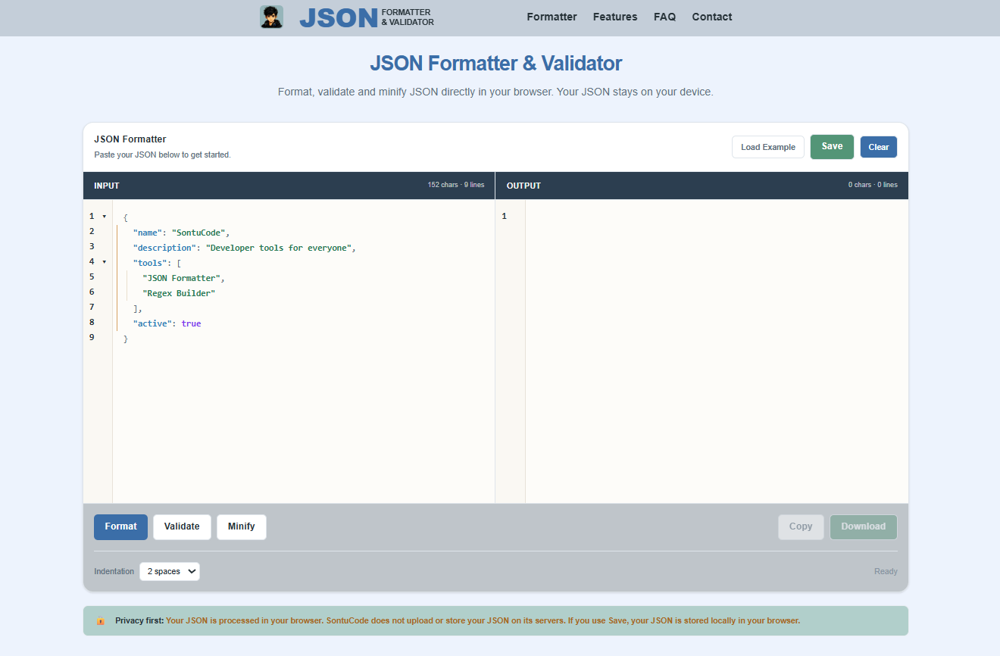

# JSON Formatter

A fast, free, and privacy-friendly **JSON Formatter, Validator, Beautifier, and Minifier** built with Next.js and CodeMirror.

🌐 **[Live 👉](https://json-formatter.sontucode.dev/)**
---

---

## ✨ Features

- 🎨 Format and beautify JSON
- ✅ Validate JSON
- 🗜️ Minify JSON
- 📝 CodeMirror-powered editor
- 🔢 Line numbers
- ↪️ Automatic line wrapping
- 📂 JSON code folding
- 📐 Indentation guides
- ↩️ Undo / redo support
- 💾 Save JSON locally
- 🔄 Automatically restore saved JSON
- 📊 Character count
- 📱 Responsive design
- 🔒 No server upload required
- ⚡ Fast client-side processing

---

## 🚀 Live Demo

Try the JSON Formatter online:

**[https://json-formatter.sontucode.dev/](https://json-formatter.sontucode.dev/)**

---

## 🛠️ Tech Stack

- [Next.js](https://nextjs.org/)
- [React](https://react.dev/)
- [TypeScript](https://www.typescriptlang.org/)
- [Tailwind CSS](https://tailwindcss.com/)
- [CodeMirror 6](https://codemirror.net/)

### CodeMirror Packages

- `@codemirror/lang-json`
- `@codemirror/state`
- `@codemirror/view`
- `@codemirror/language`

---
